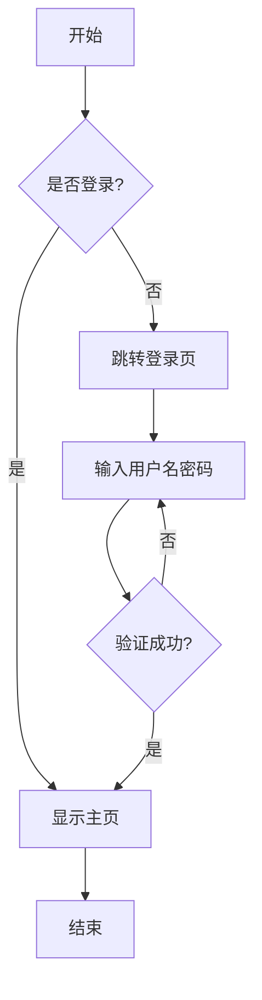
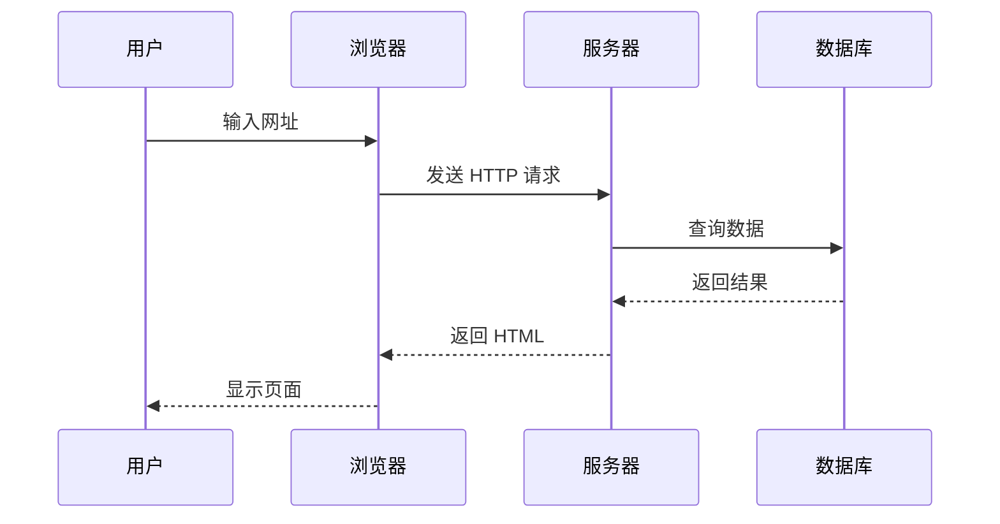
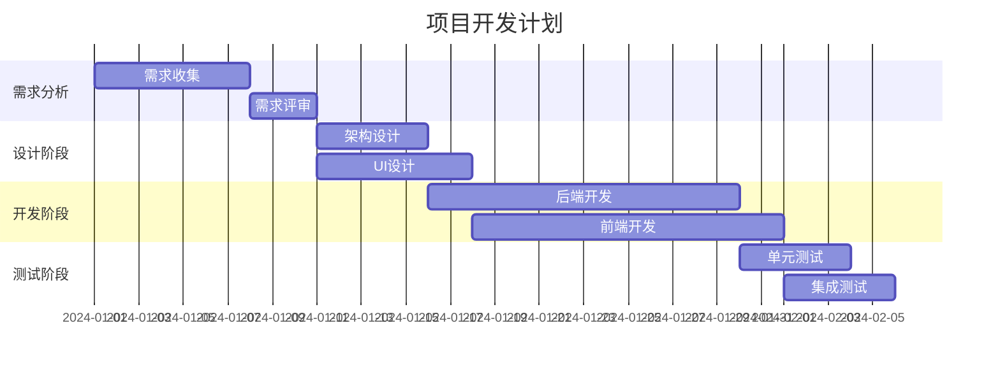
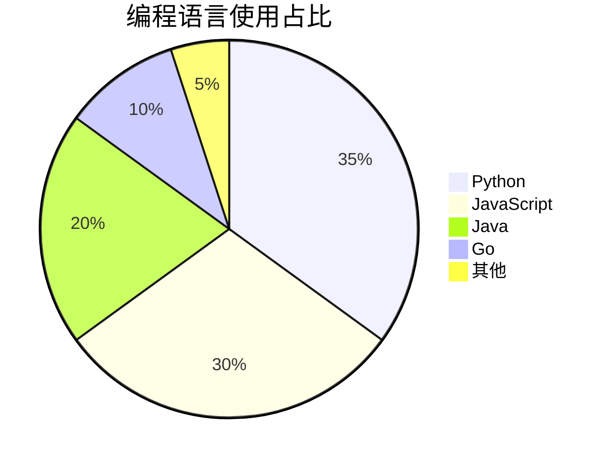

# Markdown to DOCX 转换示例

这是一个完整的示例文档,展示了所有支持的 Markdown 元素。

## 基础文本格式

这是一个普通段落,包含**粗体文本**、*斜体文本*和~~删除线文本~~。

你也可以使用`行内代码`来标记代码片段。

## 列表

### 无序列表

- 第一项
- 第二项
  - 子项 2.1
  - 子项 2.2
- 第三项

### 有序列表

1. 第一步
2. 第二步
3. 第三步

## 引用

> 这是一段引用文本。
> 
> 引用可以包含多个段落。

## 代码块

### Python 代码

```python
def fibonacci(n):
    """计算斐波那契数列"""
    if n <= 1:
        return n
    return fibonacci(n-1) + fibonacci(n-2)

# 测试
for i in range(10):
    print(f"F({i}) = {fibonacci(i)}")
```

### JavaScript 代码

```javascript
// 异步函数示例
async function fetchData(url) {
    try {
        const response = await fetch(url);
        const data = await response.json();
        return data;
    } catch (error) {
        console.error('Error:', error);
    }
}
```

## Mermaid 图表

### 流程图



### 时序图



### 甘特图



### 饼图



## 数学公式

### 行内公式

爱因斯坦的质能方程: $E = mc^2$

圆的面积公式: $A = \pi r^2$

### 块级公式

高斯积分:

$$
\int_{-\infty}^{\infty} e^{-x^2} dx = \sqrt{\pi}
$$

欧拉公式:

$$
e^{i\pi} + 1 = 0
$$

傅里叶变换:

$$
F(\omega) = \int_{-\infty}^{\infty} f(t) e^{-i\omega t} dt
$$

## 表格

### 简单表格

| 姓名 | 年龄 | 职业 |
|------|------|------|
| 张三 | 28 | 工程师 |
| 李四 | 32 | 设计师 |
| 王五 | 25 | 产品经理 |

### 对齐表格

| 左对齐 | 居中对齐 | 右对齐 |
|:-------|:--------:|-------:|
| 内容1  | 内容2    | 内容3  |
| A      | B        | C      |
| X      | Y        | Z      |

### 复杂表格

| 功能 | 描述 | 状态 | 优先级 |
|------|------|------|--------|
| Mermaid 支持 | 支持流程图、时序图等 | ✅ 完成 | 高 |
| LaTeX 公式 | 支持数学公式渲染 | ✅ 完成 | 高 |
| 代码高亮 | 支持多种语言高亮 | ✅ 完成 | 中 |
| 自定义样式 | 支持 Word 模板 | ✅ 完成 | 中 |
| 批量转换 | 支持多文件转换 | ✅ 完成 | 低 |

## 图片


## 链接

- [Pandoc 官网](https://pandoc.org/)
- [Mermaid 文档](https://mermaid-js.github.io/)
- [Markdown 指南](https://www.markdownguide.org/)

## 水平线

---

## 脚注

这是一段包含脚注的文本[^1]。

这是另一个脚注[^2]。

[^1]: 这是第一个脚注的内容。
[^2]: 这是第二个脚注的内容,可以包含更多详细信息。

## 任务列表

- [x] 完成需求分析
- [x] 设计系统架构
- [x] 实现核心功能
- [ ] 编写测试用例
- [ ] 部署到生产环境

## 嵌套结构

1. 第一级
   - 子项 1.1
   - 子项 1.2
     - 子子项 1.2.1
     - 子子项 1.2.2
2. 第二级
   - 子项 2.1
     ```python
     # 嵌套代码块
     print("Hello")
     ```
   - 子项 2.2

## 总结

这个示例展示了 Markdown to DOCX 转换器支持的所有主要功能:

- ✅ 基础文本格式
- ✅ 列表和嵌套结构
- ✅ 代码块和语法高亮
- ✅ Mermaid 图表 (流程图、时序图、甘特图、饼图等)
- ✅ LaTeX 数学公式
- ✅ 表格
- ✅ 图片和链接
- ✅ 引用和脚注

转换后的 DOCX 文档将保持这些元素的格式和样式。

---

**测试转换:**

```bash
# 转换此文件
./scripts/convert.sh examples/demo.md

# 查看生成的 demo.docx
open examples/demo.docx
```
