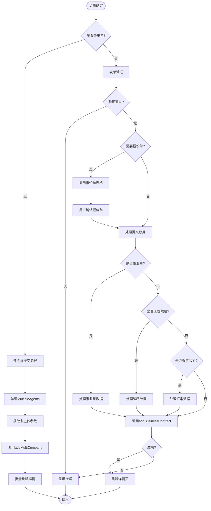
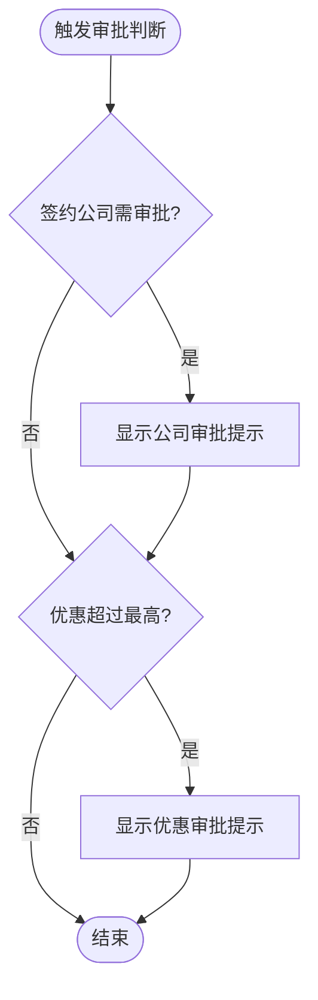
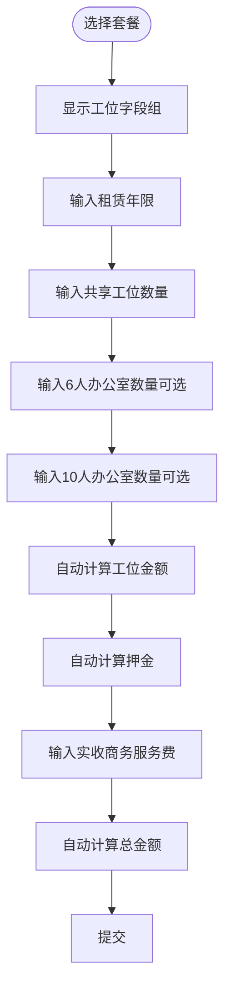
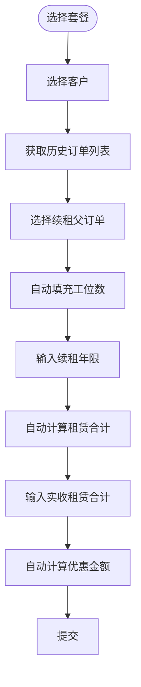
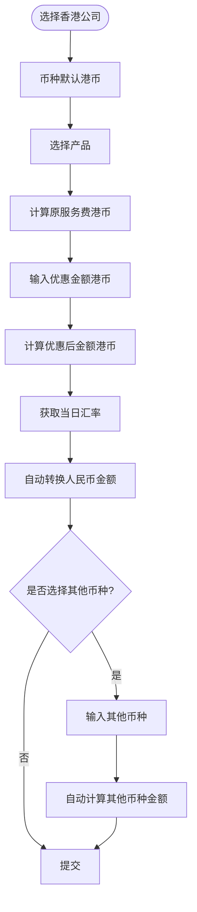

---
pandoc:
  outputFormat: docx
---

# 新签二曲项目 - 完整文档

> **文件**: `CreateBusinessContract.vue` (3,261行)  
> **功能**: 新签二曲项目弹窗的完整逻辑梳理  
> **生成时间**: 2024年

---

## 目录

1. [概述](#1-概述)
2. [字段清单](#2-字段清单)
3. [场景分类](#3-场景分类)
4. [核心流程](#4-核心流程)
5. [事业星系列详解](#5-事业星系列详解)
6. [多币种处理](#6-多币种处理)
7. [重点注意事项](#7-重点注意事项)

---

## 1. 概述

### 1.1 功能说明

新签二曲项目弹窗用于创建多种类型的商务合同:
- **商务产品** (type=4) - 常规产品/套餐产品/事业星系列/工位续租
- **小项目** (type=15) - 简化流程的小项目
- **教育产品** (type=7) - 教育类产品

### 1.2 核心特性

- ✅ 支持个人签约和企业签约
- ✅ 支持线上/线下支付定金
- ✅ 支持服务费优惠配置
- ✅ 支持多币种(港币/人民币等)
- ✅ 支持事业星复杂计算
- ✅ 支持工位续租功能
- ✅ 支持多主体签约
- ✅ 审批提示机制

### 1.3 代码统计

- **代码行数**: 3,261行
- **主要场景**: 7+个
- **字段数量**: ~50个
- **API调用**: 15+个

---

## 2. 字段清单

### 2.1 基础必填字段

| 字段名 | 字段标签 | 字段类型 | 默认值 | 是否必填 | 说明 |
|--------|----------|----------|--------|----------|------|
| `type` | 产品分类 | Select | '' | 是 | 4-商务/15-小项目/7-教育等 |
| `company` | 签约公司 | Select | 2 | 是 | 动态获取公司列表 |
| `username` | 客户信息 | Input | '' | 是 | 通过SelectCustomer组件填充 |
| `customer_id` | 客户ID | Hidden | '' | 是 | 选择客户后自动填充 |
| `mobile` | 签约手机号 | Select | null | 是 | 从客户协同手机号中选择 |
| `sign_type` | 签约类型 | Radio | '' | 是 | 1-个人签约/2-企业签约 |

### 2.2 产品相关字段

**商务产品 (type=4)**

| 字段名 | 字段标签 | 是否必填 | 说明 |
|--------|----------|----------|------|
| `business_type` | 产品类型 | 是 | 1-常规产品/2-套餐产品 |
| `productName` | 产品名称 | 是 | 通过组件选择填充 |
| `presale_product_t` | 产品ID | 是 | 产品ID或子产品ID |
| `set_meal_id` | 套餐ID | 条件必填 | business_type=2时必填 |

**小项目 (type=15)**

| 字段名 | 字段标签 | 是否必填 | 说明 |
|--------|----------|----------|------|
| `business_type` | 产品类型 | - | 固定为1 |
| `productName` | 产品名称 | 是 | 通过组件选择填充 |

**教育产品 (type=7)**

| 字段名 | 字段标签 | 是否必填 | 说明 |
|--------|----------|----------|------|
| `presale_product_id` | 主合同协议 | 是 | 主项目产品 |
| `cutoff_time` | 服务截止日期 | 是 | 教育类必填 |

### 2.3 费用相关字段

| 字段名 | 字段标签 | 是否必填 | 说明 |
|--------|----------|----------|------|
| `origin_fee` | 原服务费金额 | 是 | 自动计算 |
| `service_fee_discount` | 服务费优惠金额 | 条件必填 | 优惠金额 |
| `actual_service_fee` | 实收服务费金额 | 是 | 实际收取金额 |
| `service_fee_agreement` | 优惠协议 | 条件必填 | 优惠协议选择 |
| `pay_type` | 是否在线支付定金 | 条件必填 | 1-是/0-否 |
| `deposit_fee` | 在线支付金额 | 条件必填 | 根据pay_type自动填充 |
| `service_pay_type` | 服务费支付方式 | 条件必填 | 1-线上支付/0-线下转账 |

### 2.4 多币种字段 (香港公司)

| 字段名 | 字段标签 | 是否必填 | 说明 |
|--------|----------|----------|------|
| `actual_service_fee_currency` | 实收币种 | 是 | 1-人民币/4-港币等 |
| `current_exchange_rate` | 汇率 | - | 自动获取 |
| `other_currency` | 其他币种 | 否 | 用于多币种转换 |
| `pay_currency_received` | 其他币种金额 | 否 | 自动计算 |

### 2.5 事业星系列产品字段

**基础工位字段**

| 字段名 | 字段标签 | 是否必填 | 说明 |
|--------|----------|----------|------|
| `extra_info.rent_cnt` | 租赁人数/间数 | 是 | 根据产品类型显示不同标签 |
| `extra_info.gx_year` | 租赁年限 | 是 | 租赁年限 |
| `extra_info.gxgw_price` | 共享工位价格 | - | 后台配置价格 |

**详细工位字段 (事业星/事业星mini)**

| 字段名 | 字段标签 | 是否必填 | 说明 |
|--------|----------|----------|------|
| `extra_info.gxgw_quantity` | 共享工位数量 | 条件必填 | 共享工位数量 |
| `extra_info.gxgw6_quantity` | 共享6人办公室数量 | 否 | 6人办公室数量 |
| `extra_info.gxgw10_quantity` | 共享10人办公室数量 | 否 | 10人办公室数量 |
| `extra_info.gxgw_fee` | 共享工位金额 | - | 自动计算 |
| `extra_info.gxgw6_fee` | 共享6人金额 | - | 自动计算 |
| `extra_info.gxgw10_fee` | 共享10人金额 | - | 自动计算 |
| `extra_info.surety_fee` | 押金 | - | 自动计算 |
| `extra_info.business_fee` | 实收商务服务费 | 是 | 商务服务费 |

**工位续租字段**

| 字段名 | 字段标签 | 是否必填 | 说明 |
|--------|----------|----------|------|
| `renewal_parent_order_sn` | 续租父订单号 | 是 | 从历史订单中选择 |
| `extra_info.renewal_term` | 续租年限 | 是 | 续租年限 |
| `extra_info.renewal_quantity` | 工位数 | - | 从父订单获取 |
| `renewal_actual_service_fee` | 实收租赁合计 | 是 | 实收金额 |

### 2.6 特殊产品ID配置

**事业星产品ID**
```javascript
// 事业星产品固定配置id
fixedProductIds: [696, 697]

// 事业星产品，展示租赁人数的产品
fixedRentCntIds: [731, 730]

// 创世纪主体下的产品ids，展示租赁人数的产品
creationGenesisRentCntIds: [735, 734, 732, 729]

// 事业星新版 展示租赁人数/间数
creationNewRentCntIds: [761, 760, 759, 758, 757, 756]

// 香港事业发展·事业星mini（深圳市盈河世纪科技有限公司）
careerStarMiniYinheIds: [762, 763, 764, 765, 766, 767]

// 香港事业发展·事业星和事业星s
careerStarAndSIds: [774, 775, 776, 777, 778, 779, 768, 769, 770, 771, 772, 773]

// 工位续租产品ID
workstationRenewalProductIds: [780, 781, 782, 783, 784, 785]
```

**事业星子产品ID**
```javascript
// 共享工位
careerBusinessProductId: 1488

// 共享6人办公室
careerBusinessProductId6: 1493

// 共享10人办公室
careerBusinessProductId10: 1494
```

---

## 3. 场景分类

### 3.1 商务产品 (type=4)

#### 场景A1: 常规商务产品 (business_type=1)

**流程**: 选择产品 → 计算原服务费 → 选择优惠协议 → 输入优惠金额 → 计算实收金额

**特点**:
- 使用SelectBusiness组件选择产品
- 简单的费用计算
- 支持服务费优惠

#### 场景A2: 套餐商务产品 (business_type=2)

**流程**: 选择套餐 → 判断套餐类型 → 特殊处理(事业星/工位续租/普通套餐)

**特点**:
- 使用ComposeSelectBusiness组件选择套餐
- 可能包含事业星特殊逻辑
- 可能是工位续租产品

#### 场景A3: 事业星系列产品

**产品ID**: 696, 697, 762-767, 756-761, 768-779, 729-736

**特殊字段**:
- 租赁人数/间数
- 租赁年限
- 共享工位/6人/10人办公室数量
- 自动计算押金和工位金额

**计算公式**:
```javascript
// 工位金额
gxgw_fee = gxgw_quantity * gx_year * gxgw_price
gxgw6_fee = gxgw6_quantity * gx_year * gxgw6_price
gxgw10_fee = gxgw10_quantity * gx_year * gxgw10_price

// 押金
surety_fee = (gxgw_quantity * gxgw_price / 12 * 2) + 
             (gxgw6_quantity * gxgw6_price / 12 * 2) + 
             (gxgw10_quantity * gxgw10_price / 12 * 2)

// 总金额
actual_service_fee = gxgw_fee + gxgw6_fee + gxgw10_fee + surety_fee + business_fee
```

#### 场景A4: 工位续租产品 (ID: 780-785)

**流程**: 选择客户 → 获取历史订单 → 选择续租父订单 → 输入续租年限 → 自动计算金额

**计算公式**:
```javascript
// 租赁合计
gxgw_fee = renewal_quantity * gx_year * gw_price

// 优惠金额
service_fee_discount = gxgw_fee - renewal_actual_service_fee

// 押金固定为0
surety_fee = 0
```

### 3.2 小项目 (type=15)

**特点**:
- 简化流程
- 固定business_type=1
- 特定公司(銀河國際咨詢有限公司)

**流程**: 选择公司 → 选择客户 → 选择签约类型 → 选择产品 → 输入优惠金额 → 提交

### 3.3 教育产品 (type=7)

**特点**:
- 需要服务截止日期
- 支持赠送协议
- 需要学生姓名(预填信息)

**流程**: 选择公司 → 选择客户 → 选择签约类型 → 选择主合同协议 → 选择服务截止日期 → 选择赠送协议 → 填写学生姓名 → 提交

---

## 4. 核心流程

### 4.1 整体提交流程



### 4.2 审批判断流程



---

## 5. 事业星系列详解

### 5.1 事业星/事业星mini (ID: 696, 697)

**流程图**:


**计算逻辑**:
```javascript
// 1. 工位金额计算
gxgw_fee = gxgw_quantity * gx_year * gxgw_price
gxgw6_fee = gxgw6_quantity * gx_year * gxgw6_price
gxgw10_fee = gxgw10_quantity * gx_year * gxgw10_price

// 2. 押金计算 (每种工位类型押金 = 数量 * 单价/12 * 2)
gxgwDeposit = gxgw_quantity * (gxgw_price / 12) * 2
gxgw6Deposit = gxgw6_quantity * (gxgw6_price / 12) * 2
gxgw10Deposit = gxgw10_quantity * (gxgw10_price / 12) * 2
surety_fee = gxgwDeposit + gxgw6Deposit + gxgw10Deposit

// 3. 总金额计算
actual_service_fee = gxgw_fee + gxgw6_fee + gxgw10_fee + surety_fee + business_fee

// 4. 优惠金额计算
service_fee_discount = (原商务服务费 - business_fee) + 固定优惠
```

### 5.2 工位续租产品 (ID: 780-785)

**流程图**:


**计算逻辑**:
```javascript
// 1. 租赁合计
gxgw_fee = renewal_quantity * gx_year * gw_price

// 2. 优惠金额
service_fee_discount = gxgw_fee - renewal_actual_service_fee

// 3. 押金固定为0
surety_fee = 0

// 4. 实收金额
actual_service_fee = renewal_actual_service_fee
```

### 5.3 事业星和事业星s优惠计算

**特殊优惠逻辑** (ID: 768-779):
```javascript
// 基础优惠
const baseDiscount = businessServiceFee - business_fee

// 固定优惠
const fixedDiscount = company === 13 ? 30000 : 28000

// 总优惠
service_fee_discount = baseDiscount + (isDiscount ? fixedDiscount : 0)
```

---

## 6. 多币种处理

### 6.1 香港公司商务产品

**适用公司**: company=5/8/9/13

**流程图**:


### 6.2 汇率转换逻辑

```javascript
// 1. 港币转人民币
actual_service_fee_rmb = hk_discount_service_fee / current_exchange_rate

// 2. 其他币种转换
pay_currency_received = actual_service_fee * HKRate / other_currency_rate

// 3. 汇率获取
getExchangeRateRecord({
  currency_id: actual_service_fee_currency
}).then(res => {
  this.current_exchange_rate = res.data.exchange_rate
  this.createRataList = res.data.list
})
```

### 6.3 多币种字段显示条件

**香港公司 (company=5/8/9/13)**:
- 显示: `actual_service_fee_currency`, `current_exchange_rate`
- 币种默认: 4(港币)

**银河集团香港-HK商务 (company=13 && type=4 && is_mx=0)**:
- 显示: `other_currency`, `pay_currency_received`

**其他公司**:
- 币种默认: 1(人民币)

---

## 7. 重点注意事项

### 7.1 事业星系列复杂计算

**事业星系列产品**有非常复杂的计算逻辑，包括:
- 工位金额计算 (共享工位/6人/10人办公室)
- 押金计算 (每种工位类型单独计算)
- 多种工位类型组合
- 不同公司的优惠规则

**关键点**:
1. 押金计算公式: `数量 * (单价/12) * 2`
2. 工位金额计算公式: `数量 * 年限 * 单价`
3. 事业星和事业星s有固定优惠(28000或30000)

### 7.2 多币种汇率处理

**多币种功能**需要:
- 实时获取汇率
- 自动转换金额
- 保存汇率记录ID

**注意事项**:
1. 香港公司默认使用港币
2. 汇率转换时要保存`create_rata_id`
3. 其他币种金额自动计算,不可编辑

### 7.3 工位续租特殊处理

**工位续租产品** (ID: 780-785):
- 需要选择续租父订单
- 工位数从父订单自动获取
- 押金固定为0
- 优惠金额自动计算

### 7.4 多主体签约

**判断条件**:
```javascript
isMultiCompany = selectData[0].company_codes?.length > 1 && business_type === 2
```

**特点**:
- 使用MultipleAgents组件
- 调用addMultiCompany API
- 批量创建订单
- 批量跳转详情页

### 7.5 审批提示机制

**两种审批提示**:
1. **公司审批** (company_approval): 非深圳盈科签约需审批
2. **优惠审批** (discount_approval): 超过最高优惠需审批

**触发时机**:
- 产品选择后
- 优惠金额输入后
- 使用活动优惠勾选后

### 7.6 明星套餐特殊处理

**明星套餐** (is_mx=1):
- `actual_service_fee`自动等于`origin_fee`
- `actual_service_fee`字段禁用
- 不允许修改实收金额

### 7.7 报价单显示条件

**需要显示报价单**:
```javascript
if (
  (isBusiness && isShowQuote && [2, 8].includes(company) && [1, 2].includes(business_type)) 
  || isSmall
) && !isHaveQuote
```

### 7.8 优惠金额限制

**香港公司**:
```javascript
// 只能输入整数
service_fee_discount = val.replace(/[^0-9]/g, '')

// 不能超过原服务费
if (service_fee_discount > origin_fee) {
  service_fee_discount = origin_fee
}
```

---

## 附录

### A. 相关文件

- 列表页: `RemoteSigning.vue`
- 新签二曲项目: `CreateBusinessContract.vue`
- 预填信息组件: `PreFiledContractInfo.vue`
- 选择客户组件: `SelectCustomer.vue`
- 选择产品组件: `SelectBusiness.vue`, `ComposeSelectBusiness.vue`
- 多主体组件: `MultipleAgents.vue`

### B. API文件

- `/api/consultant/contract.js`

### C. 主要API

- `addBusinessContract` - 创建商务合同
- `addMultiCompany` - 多主体签约
- `getExchangeRateRecord` - 获取汇率
- `getRenewalParentOrderSn` - 获取续租订单
- `getBusinessContact` - 获取商务协议
- `getXmmContactList` - 获取小项目协议

---

**文档完成时间**: 2024年  
**文档版本**: v1.0  
**维护建议**: 当业务逻辑变更时,请同步更新本文档
