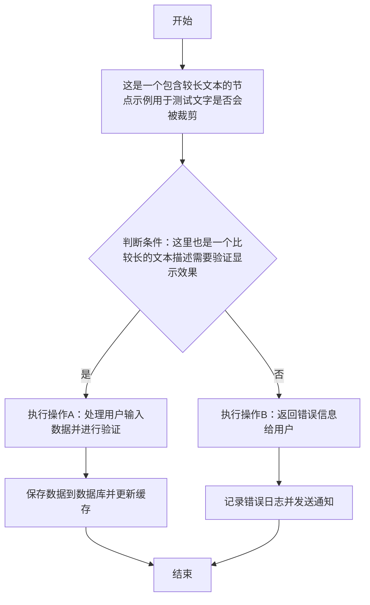
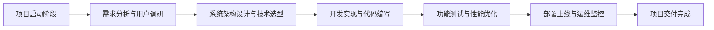
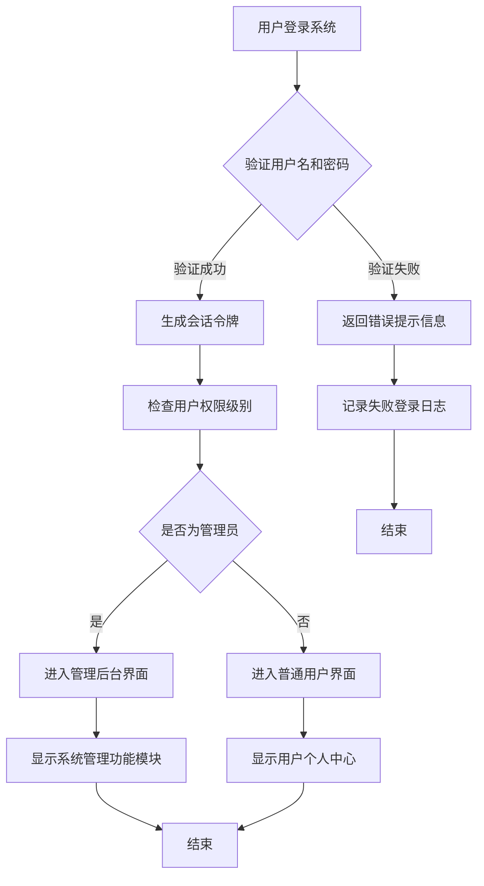

# Mermaid 流程图长文本测试

## 测试用例 1: 包含长文本的流程图

```mermaid
flowchart TD
    A[开始] --> B[这是一个包含较长文本的节点示例用于测试文字是否会被裁剪]
    B --> C{判断条件：这里也是一个比较长的文本描述需要验证显示效果}
    C -->|是| D[执行操作A：处理用户输入数据并进行验证]
    C -->|否| E[执行操作B：返回错误信息给用户]
    D --> F[保存数据到数据库并更新缓存]
    E --> G[记录错误日志并发送通知]
    F --> H[结束]
    G --> H
```

## 测试用例 2: 多节点长文本流程图

```mermaid
flowchart LR
    Start[项目启动阶段] --> Analysis[需求分析与用户调研]
    Analysis --> Design[系统架构设计与技术选型]
    Design --> Development[开发实现与代码编写]
    Development --> Testing[功能测试与性能优化]
    Testing --> Deploy[部署上线与运维监控]
    Deploy --> End[项目交付完成]
```

## 测试用例 3: 纵向复杂流程图

```mermaid
flowchart TD
    A[用户登录系统] --> B{验证用户名和密码}
    B -->|验证成功| C[生成会话令牌]
    B -->|验证失败| D[返回错误提示信息]
    C --> E[检查用户权限级别]
    E --> F{是否为管理员}
    F -->|是| G[进入管理后台界面]
    F -->|否| H[进入普通用户界面]
    G --> I[显示系统管理功能模块]
    H --> J[显示用户个人中心]
    I --> K[结束]
    J --> K
    D --> L[记录失败登录日志]
    L --> M[结束]
```
